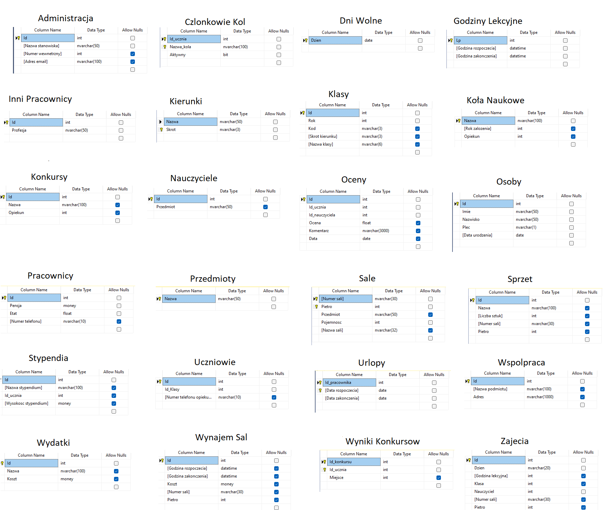

# Baza Danych Szkoły
Autorzy: Filip Szymeczko, Adrian Kacperski, Mikołaj Janusz

Projekt "Baza Danych Szkoły"

# Założenia projektu

Celem projektu jest stworzenie bazy danych szkoły ułatwiającej zarządzanie placówką poprzez m.in. monitorowanie wydatków, zarządzanie urlopami pracowników, w tym nauczycieli oraz wiele innych przydatnych funkcji.

Podstawowymi założeniami projektu była uniwersalność, ograniczyliśmy się do tabel występujących w większości szkół, więc w przypadku szkół np. specjalistycznych które mają unikalny system klas baza będzie ograniczona. Jednak baza może zostać łatwo rozwinięta o dodatkowe funkcjonalności. Również dane przykładowe są ograniczone, w praktyce szkoły mogą mieć znacznie więcej ocen, uczniów. Ograniliczyliśmy te dane aby skupić się na łatwym pokazaniu funkcjonalności.

## Schemat Pielęgnacji Bazy Danych

Jako że szkoła jest ważną instytucją publiczną i nie może sobie pozwolić na utracenie danych takich jak np. oceny, zalecane jest utworzenie różnicowej kopii zapasowej codziennie, w godzinnach nocnych gdy szkoła jest zamknięta i nie odbywają się zajęcia. Również zalecamy tworzenie cotygodniowej pełnej kopii zapasowej w nocnych godzinach weekendowych również z powodu małego prawdopodobieństwa używania bazy w tym czasie.

# Diagram ER
Na diagramie znajduję sie graficzna reprezentacja zależności pomiędzy tabelami w naszej bazie.


# Schemat Bazy Danych
W schemacie bazy danych znajdują się wszystkie tabele i ich dane, typy tych danych, oraz dopuszczanie braku danej (NOT NULL).

# Tabele

- Administracja
- Członkowie kół
- Dni wolne
- Godziny lekcyjne
- Inni pracownicy
- Kierunki
- Klasy
- Kola naukowe
- Konkursy
- Nauczyciele
- Oceny
- Osoby
- Pracownicy
- Przedmioty
- Sale
- Sprzęt
- Stypendia
- Uczniowe
- Urlopy
- Wspolprace
- Wydatki
- Wynajem sal
- Wyniki konkursow
- Zajecia
- Zarzady klas
- Zastepstwa

# Widoki
Utworzone widoki pozwalają na pokazanie najczęściej według nas wybieranych danych. Nazwy widoków utworzone są tak aby było jasne co one wyświetlają	

```tsql
CREATE VIEW [Spis klas] AS
	SELECT [Nazwa klasy], Nazwisko, Imie FROM Osoby
	JOIN Uczniowie ON Osoby.Id = Uczniowie.Id
	JOIN Klasy ON Uczniowie.Id_Klasy = Klasy.Id
	ORDER BY [Nazwa klasy], Nazwisko, Imie OFFSET 0 ROWS
```

```tsql
CREATE VIEW [Najlepsi Stypendysci] AS
    SELECT Id_ucznia, SUM([Wysokosc stypendium]) AS [Wysokosc Stypendium] FROM Stypendia 
    GROUP BY Id_ucznia ORDER BY [Wysokosc stypendium] DESC OFFSET 0 ROWS
```

```tsql
CREATE VIEW [Liczebnosc klas] AS
    SELECT [Nazwa klasy], COUNT(*) AS [Liczba osob] FROM Uczniowie
    JOIN Klasy ON Uczniowie.Id_Klasy = Klasy.Id
    GROUP BY [Nazwa klasy]
    ORDER BY [Nazwa klasy] OFFSET 0 ROWS
```

```tsql
CREATE VIEW [Zwyciezcy Konkursow] AS
	SELECT Id, Imie, Nazwisko FROM Osoby WHERE Id
	IN (SELECT Id_Ucznia FROM [Wyniki konkursow] WHERE Miejsce = 1)
```

```tsql
CREATE VIEW [Suma Wydatkow] AS
	SELECT SUM(koszt) AS [Suma wydatkow szkoly] FROM Wydatki
```

```tsql
CREATE VIEW [Zarządy Klas] AS
	SELECT Osoby.Id, Imie, Nazwisko, [Zarzad klas].Funkcja, Klasy.[Nazwa klasy] FROM Osoby 
	JOIN [Zarzad klas] ON Osoby.Id = [Zarzad klas].Id_ucznia
	JOIN Uczniowie ON Uczniowie.Id = Osoby.Id
	JOIN Klasy ON Uczniowie.Id_Klasy = Klasy.Id
	ORDER BY [Nazwa klasy] DESC OFFSET 0 ROWS
```

```tsql
CREATE VIEW [Wypisz Nauczycieli] AS
	SELECT Osoby.Id, Imie, Nazwisko, Nauczyciele.Przedmiot, Pracownicy.Pensja, 
		Pracownicy.Etat, Pracownicy.[Numer telefonu] FROM Osoby
	JOIN Nauczyciele ON Osoby.Id = Nauczyciele.Id
	JOIN Pracownicy ON Osoby.Id = Pracownicy.Id
```

```tsql
CREATE VIEW [Wypisz Uczniow] AS
	SELECT Osoby.Id, Imie, Nazwisko, Klasy.[Nazwa klasy] FROM Osoby
	JOIN Uczniowie ON Osoby.Id = Uczniowie.Id
	JOIN Klasy ON Klasy.Id = Uczniowie.Id_Klasy
```

```tsql
CREATE VIEW [Aktualne Zastepstwa] AS
	SELECT A.Imie AS [Imie Zastepowanego], A.Nazwisko AS [Nazwisko Zastepowanego], B.Imie AS [Imie Zastepujacego], B.Nazwisko AS [Nazwisko Zastepujacego], 
		Zastepstwa.[Data rozpoczecia], Zastepstwa.[Data zakonczenia], Nauczyciele.Przedmiot FROM Zastepstwa
	JOIN Zajecia ON Zastepstwa.Id_zajec = Zajecia.Id
	JOIN Osoby A ON Zajecia.Nauczyciel = A.Id
	JOIN Osoby B ON Zastepstwa.Id_nauczyciela = B.Id
	JOIN Nauczyciele ON Zajecia.Nauczyciel = Nauczyciele.Id
	WHERE [Data zakonczenia] > GETDATE()
```

```tsql
CREATE VIEW [Ilosc czlonkow kol] AS
    SELECT [Kola naukowe].Nazwa, Count(Id_ucznia) AS [Ilosc czlonkow] FROM [Czlonkowie kol]
    JOIN [Kola naukowe] ON [Czlonkowie kol].[Nazwa_kola] = [Kola naukowe].Nazwa
    GROUP BY [Kola naukowe].Nazwa
    ORDER BY [Ilosc czlonkow] DESC OFFSET 0 ROWS
```

```tsql
CREATE VIEW [Najlepsi uczniowie] AS
	SELECT [Nazwa klasy], Imie, Nazwisko, AVG(Ocena) AS Srednia FROM Uczniowie
	JOIN Klasy ON Uczniowie.Id_Klasy = Klasy.Id
	JOIN Oceny ON Uczniowie.Id = Oceny.Id_ucznia
	JOIN Osoby ON Uczniowie.Id = Osoby.Id
	GROUP BY [Nazwa klasy], Imie, Nazwisko
	ORDER BY AVG(Ocena) DESC OFFSET 0 ROWS
```

# Funkcje
Funkcje służą nam za sparametryzowane widoki, w których możemy podać argumenty aby np. zawęzić obszar wypisywanych później danych.
```tsql
CREATE FUNCTION plan_zajec_klasy (@dzien NVARCHAR(20), @klasa NVARCHAR(6))
RETURNS @harmonogram TABLE
(
	[Przedział godzin] NVARCHAR(100),
	Przedmiot NVARCHAR(50),
	Nauczyciel NVARCHAR(300),
	Sala NVARCHAR(10)
)
AS
BEGIN
	IF @dzien NOT IN ('Poniedziałek', 'Wtorek', 'Środa', 'Czwartek', 'Piątek')
	BEGIN
		INSERT INTO @harmonogram VALUES ('Taki', 'dzień', 'nie', 'istnieje')
	END
	ELSE
	IF @klasa NOT IN (SELECT [Nazwa klasy] FROM Klasy)
	BEGIN
		INSERT INTO @harmonogram VALUES ('Taka', 'klasa', 'nie', 'istnieje')
	END
	ELSE
	BEGIN
	INSERT INTO @harmonogram 
		SELECT
			CONCAT(CAST([Godziny lekcyjne].[Godzina rozpoczecia] AS TIME(0)) , ' - ', CAST([Godziny lekcyjne].[Godzina zakonczenia] AS TIME(0))),
			Nauczyciele.Przedmiot,
			CONCAT(Osoby.Imie, ' ', Osoby.Nazwisko),
			Sale.[Nazwa sali]
		FROM Zajecia
		JOIN Klasy ON Zajecia.Klasa = Klasy.Id
		JOIN [Godziny lekcyjne] ON Zajecia.[Godzina lekcyjna] = [Godziny lekcyjne].Lp
		JOIN Nauczyciele ON Zajecia.Nauczyciel = Nauczyciele.Id
		JOIN Osoby ON Zajecia.Nauczyciel = Osoby.Id
		JOIN Sale ON Zajecia.[Numer sali] = Sale.[Numer sali] AND Zajecia.Pietro = Sale.Pietro
		WHERE Dzien = @dzien AND Klasy.[Nazwa klasy] = @klasa
	END
	RETURN
END
```

## Użycie funkcji
```tsql
SELECT * FROM plan_zajec_klasy('Poniedziałek', '1MFa')
```

# Procedury Składowane
Procedury składowane w naszej bazie pozwalają np. na wypisanie uczniów na zadaną przez użytkownika literę, czy wypisanie średniej ocen jakieś określonej klasy.
```tsql
GO
CREATE PROC uczniowie_na_litere
(@litera CHAR)
AS
	SELECT Imie, Nazwisko FROM Uczniowie
	JOIN Osoby ON Uczniowie.Id = Osoby.Id
	WHERE Nazwisko LIKE @litera + '%'
	ORDER BY Imie
GO
```
```tsql
GO
CREATE PROC srednia_w_klasie
@klasa NVARCHAR(6)
@srednia_klasy DECIMAL(18,3) OUTPUT
AS
	SELECT @srednia_klasy = AVG(Ocena) FROM Oceny
	JOIN Uczniowie ON Oceny.Id_ucznia = Uczniowie.Id
	JOIN Klasy ON Uczniowie.Id_Klasy = Klasy.Id
	WHERE [Nazwa klasy] = @klasa
GO
```
```tsql
GO
CREATE PROC srednia_ucznia
@imie NVARCHAR(50),
@nazwisko NVARCHAR(50)
AS
	SELECT AVG(Ocena) AS Srednia FROM Oceny
	JOIN Uczniowie ON Oceny.Id_ucznia = Uczniowie.Id
	JOIN Osoby ON Uczniowie.Id = Osoby.Id
	WHERE Imie = @imie AND Nazwisko = @nazwisko
GO
```

```tsql
GO
CREATE PROC liczba_dni_wolnych
@dni_wolne INT OUTPUT
AS
	SELECT @dni_wolne = COUNT(*) FROM [Dni wolne]
GO
```

```tsql
GO
CREATE PROC podzial_plci
AS
	SELECT Plec, COUNT(*), CAST(100 * COUNT(*) / (SELECT COUNT(*) FROM Uczniowie) AS NVARCHAR) + '%' AS [Podzial procentowy] FROM Uczniowie
	JOIN Osoby ON Uczniowie.Id = Osoby.Id
GROUP BY Plec
GO
```
## Wykonywanie Procedur
```tsql
GO
EXEC uczniowie_na_litere 'D'

DECLARE @klasa NVARCHAR(6) = '3BCa';
DECLARE @srednia DECIMAL(18,3);
EXEC srednia_w_klasie @klasa, @srednia OUTPUT

SELECT @srednia AS 'Srednia klasy'
SELECT Imie, Nazwisko, AVG(Ocena) AS Srednia FROM Uczniowie
JOIN Osoby ON Uczniowie.Id = Osoby.Id
JOIN Klasy ON Uczniowie.Id_Klasy = Klasy.Id
JOIN Oceny ON Uczniowie.Id = Oceny.Id_ucznia
WHERE [Nazwa klasy] = @klasa
GROUP BY Imie, Nazwisko
HAVING AVG(Ocena) > @srednia
ORDER BY Srednia

EXEC srednia_ucznia 'Cygan', 'Dziewięć'

DECLARE @liczba_dni INT;
EXEC liczba_dni_wolnych @liczba_dni OUTPUT
PRINT 'Liczba dni wolnych w roku: ' + CAST(@liczba_dni AS NVARCHAR)

EXEC podzial_plci
```

# Wyzwalacze
Wyzwalacze w bazie są bardzo proste, np. dodawanie stypendium powoduje automatyczne zwiększenie kwoty wydatków na stypendia w tabeli wydatków, tak aby zautomatyzować aktualizację innych tabel. Lub aktualizowanie nazw sal czy klas według określonego schematu.

```tsql
GO
CREATE TRIGGER nazwy_klas
ON Klasy
AFTER INSERT, UPDATE
AS
	UPDATE Klasy SET [Nazwa klasy] = CONCAT(Rok, [Skrot kierunku], Kod)
GO
```
```tsql
GO
CREATE TRIGGER nazwy_sal
ON Sale
AFTER INSERT, UPDATE
AS
	UPDATE Sale SET [Nazwa sali] = CONCAT(Pietro, [Numer sali])
GO
```
```tsql
GO
CREATE TRIGGER Dodaj_Wydatek_Stypendiow
ON Stypendia
AFTER INSERT
AS
    UPDATE Wydatki SET Koszt = (Koszt + (SELECT SUM(Stypendia.[Wysokosc stypendium]) FROM inserted, Stypendia WHERE inserted.Id = Stypendia.Id))
    WHERE Nazwa IN ('Stypendia')
GO
```
```tsql
GO
CREATE TRIGGER Odejmij_Wydatek_Stypendium
ON Stypendia
INSTEAD OF DELETE
AS
    UPDATE Wydatki SET Koszt = (Koszt - (SELECT SUM(Stypendia.[Wysokosc stypendium]) FROM deleted, Stypendia WHERE deleted.Id = Stypendia.Id))
    WHERE Nazwa IN ('Stypendia')
    DELETE FROM Stypendia WHERE Stypendia.Id IN (SELECT Id FROM deleted)
GO
```
```tsql
GO
CREATE TRIGGER Dodaj_Wydatek_Pracownik
ON Pracownicy
AFTER INSERT
AS
	UPDATE Wydatki SET Koszt = (Koszt + (SELECT SUM(Pracownicy.Pensja) FROM inserted, Pracownicy WHERE inserted.Id = Pracownicy.Id))
	WHERE Nazwa IN ('Pensje Pracownikow')
GO
```

# Skrypt Tworzący Bazę Danych
Skrypt tworzący baze tworzy wyżej wymienione tabelę, wyzwalacze, procedury składowane oraz widoki, upewniając się czy baza danych nie została już wczesniej utworzona.
Następnie wstawiane są przykładowe rekordy, które oczywiście można usunąć gdyż są one opcjonalne.
Pominięto na końcu tworzenie widoków, wyzwalaczy i procedur składowanych, gdyż jest to po prostu ten sam kod który został pokazany wcześniej. w przypadku opisów wyżej wymienionych punktów.

```tsql
-- Usun poprzednia baze jesli istnieje o tej nazwie
IF EXISTS(select * from sys.databases where name='SzkolaDatabase')
	DROP DATABASE SzkolaDatabase
-- Utwórz bazę danych szkoły
CREATE DATABASE SzkolaDatabase
```

```tsql
-- tworzenie tabel
USE SzkolaDatabase

CREATE TABLE Kierunki (
	Nazwa NVARCHAR(50) NOT NULL UNIQUE,
	Skrot NVARCHAR(3) PRIMARY KEY,
)

CREATE TABLE Klasy (
	Id INT IDENTITY(1,1) PRIMARY KEY,
	Rok INT NOT NULL,
	Kod NVARCHAR(3),
	[Skrot kierunku] NVARCHAR(3) REFERENCES Kierunki (Skrot) ON DELETE CASCADE ON UPDATE CASCADE,
	[Nazwa klasy] NVARCHAR(6),
)

CREATE TABLE Przedmioty (
	Nazwa NVARCHAR(50) PRIMARY KEY,
)

CREATE TABLE Osoby (
	Id INT IDENTITY(1,1) PRIMARY KEY,
	Imie NVARCHAR(50) NOT NULL,
	Nazwisko NVARCHAR(50) NOT NULL,
	Plec NVARCHAR(1) NOT NULL,
	[Data urodzenia] DATE NOT NULL,
)

CREATE TABLE Uczniowie (
	Id INT REFERENCES Osoby PRIMARY KEY,
	Id_Klasy INT REFERENCES Klasy ON DELETE CASCADE ON UPDATE CASCADE NOT NULL,
	[Numer telefonu opiekuna] NVARCHAR(10),
	CHECK ([Numer telefonu opiekuna] NOT LIKE '%[^0-9]%'),
)

CREATE TABLE [Zarzad klas] (
	Id_ucznia INT REFERENCES Uczniowie PRIMARY KEY,
	Funkcja NVARCHAR(100) NOT NULL,
)

CREATE TABLE Pracownicy (
	Id INT REFERENCES Osoby PRIMARY KEY,
	Pensja MONEY NOT NULL,
	Etat FLOAT NOT NULL,
	[Numer telefonu] NVARCHAR(10)
)

CREATE TABLE Nauczyciele (
	Id INT REFERENCES Pracownicy PRIMARY KEY,
	Przedmiot NVARCHAR(50) REFERENCES Przedmioty (Nazwa),
)

CREATE TABLE [Inni pracownicy] (
	Id INT REFERENCES Pracownicy PRIMARY KEY,
	Profesja NVARCHAR(50) NOT NULL,
)

CREATE TABLE Administracja (
	Id INT REFERENCES Pracownicy PRIMARY KEY,
	[Nazwa stanowiska] NVARCHAR(50) NOT NULL,
	[Numer wewnetrzny] INT,
	[Adres email] NVARCHAR(100),
	CHECK ([Adres email] LIKE '%[@]%'),
)

CREATE TABLE Oceny (
	Id INT IDENTITY(1,1) PRIMARY KEY,
	Id_ucznia INT REFERENCES Uczniowie NOT NULL,
	Id_nauczyciela INT REFERENCES Nauczyciele NOT NULL,
	Ocena FLOAT NOT NULL,
	Komentarz NVARCHAR(3000),
	Data DATE NOT NULL,
)

CREATE TABLE Sale (
	[Numer sali] NVARCHAR(30),
	Pietro INT,
	PRIMARY KEY ([Numer sali], Pietro),
	Przedmiot NVARCHAR(50) REFERENCES Przedmioty,
	Pojemnosc INT NOT NULL,
	[Nazwa sali] NVARCHAR(32)
)

CREATE TABLE [Godziny lekcyjne] (
	Lp INT PRIMARY KEY ,
	[Godzina rozpoczecia] DATETIME NOT NULL,
	[Godzina zakonczenia] DATETIME NOT NULL,
)

CREATE TABLE Zajecia (
	Id INT IDENTITY(1,1) PRIMARY KEY,
	Dzien NVARCHAR(20) NOT NULL,
	CHECK (Dzien IN ('Poniedziałek', 'Wtorek', 'Środa', 'Czwartek', 'Piątek')),
	[Godzina lekcyjna] INT REFERENCES [Godziny lekcyjne] NOT NULL,
	Klasa INT REFERENCES Klasy NOT NULL,
	Nauczyciel INT REFERENCES Nauczyciele NOT NULL,
	[Numer sali] NVARCHAR(30) NOT NULL,
	Pietro INT NOT NULL,
	FOREIGN KEY ([Numer sali], Pietro) REFERENCES Sale ([Numer sali], Pietro),
)

CREATE TABLE [Kola naukowe] (
	Nazwa NVARCHAR(100) PRIMARY KEY,
	[Rok zalozenia] INT,
	Opiekun INT REFERENCES Nauczyciele,
)

CREATE TABLE [Czlonkowie kol] (
	Id_ucznia INT REFERENCES Uczniowie NOT NULL,
	Nazwa_kola NVARCHAR(100) REFERENCES [Kola naukowe] NOT NULL,
	Aktywny BIT NOT NULL,
	PRIMARY KEY (Id_ucznia, Nazwa_kola),
)

CREATE TABLE Wspolpraca (
	Id INT IDENTITY(1,1) PRIMARY KEY,
	[Nazwa podmiotu] NVARCHAR(100) NOT NULL,
	Adres NVARCHAR(1000),
)

CREATE TABLE Urlopy (
	Id_pracownika INT REFERENCES Pracownicy,
	[Data rozpoczecia] DATE NOT NULL,
	[Data zakonczenia] DATE NOT NULL,
	PRIMARY KEY (Id_pracownika, [Data rozpoczecia]),
)

CREATE TABLE Zastepstwa (
	Id INT IDENTITY(1,1) PRIMARY KEY,
	Id_zajec INT REFERENCES Zajecia NOT NULL,
	Id_nauczyciela INT REFERENCES Nauczyciele NOT NULL,
	[Data rozpoczecia] DATE NOT NULL,
	[Data zakonczenia] DATE NOT NULL,
)

CREATE TABLE [Dni wolne] (
	Dzien DATE PRIMARY KEY,
)

CREATE TABLE [Wynajem sal] (
	Id INT IDENTITY(1,1) PRIMARY KEY,
	[Godzina rozpoczecia] DATETIME NOT NULL,
	[Godzina zakonczenia] DATETIME NOT NULL,
	Koszt MONEY NOT NULL,
	[Numer sali] NVARCHAR(30) NOT NULL,
	Pietro INT NOT NULL,
	FOREIGN KEY ([Numer sali], Pietro) REFERENCES Sale ([Numer sali], Pietro),
)

CREATE TABLE Konkursy (
	Id INT IDENTITY(1,1) PRIMARY KEY,
	Nazwa NVARCHAR(100) NOT NULL,
	Opiekun INT REFERENCES Nauczyciele,
)

CREATE TABLE [Wyniki konkursow] (
	Id_konkursu INT REFERENCES Konkursy,
	Id_ucznia INT REFERENCES Uczniowie,
	Miejsce INT NOT NULL,
	PRIMARY KEY (Id_konkursu, Id_ucznia),
)

CREATE TABLE Sprzet (
	Id INT IDENTITY(1,1) PRIMARY KEY,
	Nazwa NVARCHAR(100) NOT NULL,
	[Liczba sztuk] INT NOT NULL,
	[Numer sali] NVARCHAR(30) NOT NULL,
	Pietro INT NOT NULL,
	FOREIGN KEY ([Numer sali], Pietro) REFERENCES Sale ([Numer sali], Pietro),
)

CREATE TABLE Wydatki (
	Id INT IDENTITY(1,1) PRIMARY KEY,
	Nazwa NVARCHAR(100) NOT NULL,
	Koszt MONEY NOT NULL,
)

CREATE TABLE Stypendia (
	Id INT IDENTITY(1,1) PRIMARY KEY,
	[Nazwa stypendium] NVARCHAR(100) NOT NULL,
	Id_ucznia INT REFERENCES Uczniowie NOT NULL,
	[Wysokosc stypendium] MONEY NOT NULL,
)
```

## Przykładowe Zapytania
Przykładowymi zapytaniami mogą być dowolne pytania jakie możemy mieć o aktualnej sytuacji szkoły, zapytania o oceny danego ucznia, tabeli wydatków czy zwolnienia danego nauczyciela.
